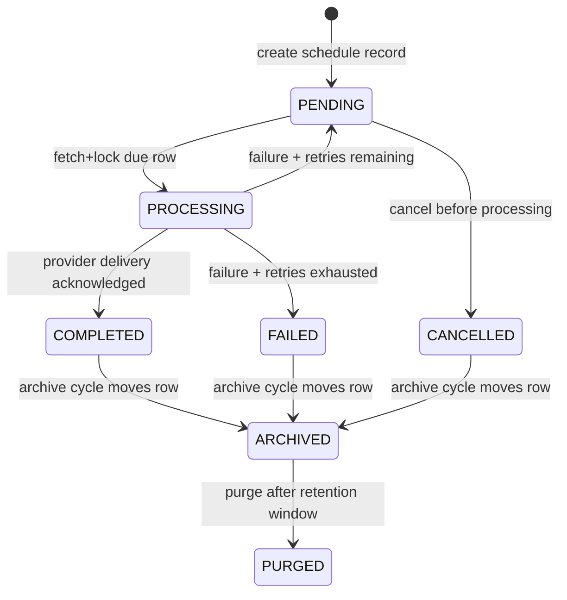
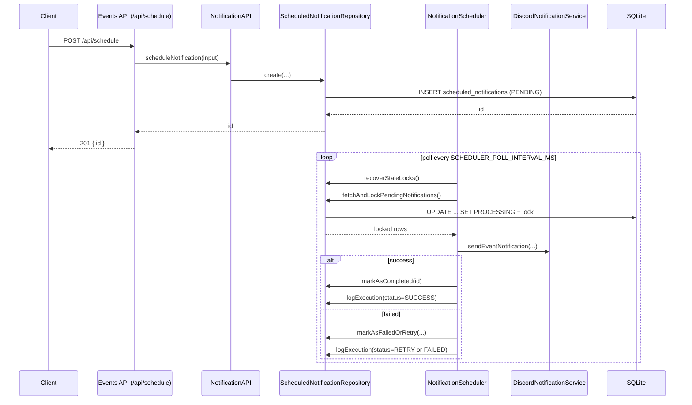

# Notification Lifecycle

This document explains the implemented notification lifecycle in Notify-Chain.
It covers both:

- Scheduled notifications managed in SQLite and executed by background schedulers.
- Real-time event notifications sent directly by the event subscriber.

The focus is accuracy against current code paths in `listener/src`.

## High-Level Overview

Notify-Chain currently has two delivery paths:

1. Scheduled path (durable, DB-backed)
- Creation via `NotificationAPI.scheduleNotification()` or `POST /api/schedule`.
- Stored in `scheduled_notifications`.
- Delivered by `NotificationScheduler`.
- Retries managed by `RetryScheduler`.
- Execution history written to `notification_execution_log`.
- Terminal rows archived by `ArchiveService` into `notification_archive`.

2. Real-time subscriber path (event-driven)
- Events polled from Stellar RPC by `EventSubscriber`.
- Valid events are added to `eventRegistry`.
- Discord delivery attempted immediately.
- Optional in-memory retry via `NotificationRetryQueue` for immediate failures.

## Lifecycle Stages



## Notification Creation

### 1) API entrypoint for scheduled notifications

`POST /api/schedule` in `listener/src/api/events-server.ts` creates scheduled notifications.

Required request fields:

- `executeAt`
- `payload`
- `targetRecipient`

Optional fields passed through to storage:

- `notificationType` (defaults to `discord`)
- `maxRetries`
- `priority`
- `eventId`
- `contractAddress`
- `metadata`

Example:

```json
{
  "payload": {
    "event": { "id": "evt_123" },
    "contractConfig": { "address": "CA..." }
  },
  "notificationType": "discord",
  "targetRecipient": "https://discord.com/api/webhooks/...",
  "executeAt": "2026-07-01T09:00:00.000Z",
  "maxRetries": 3,
  "priority": 5,
  "eventId": "evt_123",
  "contractAddress": "CA...",
  "metadata": { "source": "manual" }
}
```

### 2) Service-level validation

`NotificationAPI.scheduleNotification()` validates:

- `executeAt` is a valid `Date`
- `executeAt` is in the future
- `payload` is an object
- `targetRecipient` exists

If validation fails, the call throws an error and no DB row is created.

### 3) Idempotency (implemented but optional)

`NotificationAPI` supports idempotency if initialized with `IdempotencyKeyService` and called with an idempotency key.

Behavior:

- Same key + same request body: returns cached response notification id.
- Same key + different request body: rejects with `Idempotency key reused with different request body`.

## Validation and Scheduling

There are two distinct validation layers:

1. Schedule input validation
- Happens in `NotificationAPI.scheduleNotification()` before insert.

2. Batch payload validation
- `POST /api/notifications/validate-batch` validates batches via `BatchValidationService` and `BatchValidator`.
- Scheduler also validates fetched notifications as a batch before processing and marks each row retry/failed if the batch is invalid.

Scheduling behavior:

- New records start as `PENDING` in `scheduled_notifications`.
- Due records are selected when `execute_at <= now`.
- Locking is optimistic/distributed via `status=PROCESSING`, `processor_id`, and `lock_expires_at`.

## Delivery Pipeline

### Sequence (scheduled path)



### Delivery implementation details

- Current production delivery implementation is only `discord`.
- `webhook`, `email`, and `sms` notification types are declared but not yet implemented in `NotificationScheduler.executeNotification()`.
- `DiscordNotificationService` does notification deduplication and marks delivery success/failure from webhook HTTP response.

## Retry and Failure Handling

### Scheduled-notification retry

Failure path in scheduler:

- `NotificationScheduler` calls `markAsFailedOrRetry()`.
- `retry_count` increments.
- If retries remain: status returns to `PENDING`.
- If retries exhausted: status becomes `FAILED` and `processing_completed_at` is set.

`RetryScheduler` then handles delayed retries for rows where:

- `status = PENDING`
- `retry_count > 0`
- `next_retry_at IS NULL OR next_retry_at <= now`

Backoff:

- `calculateBackoffDelay(attempt, baseDelayMs, multiplier, maxDelayMs, jitter)`
- Optional jitter (default enabled) to reduce synchronized retry spikes.

### Lock recovery

`recoverStaleLocks()` returns expired `PROCESSING` rows to `PENDING` (or `FAILED` if max retries reached) and logs execution outcomes.

### Real-time subscriber retry

In the real-time path (`EventSubscriber`), immediate Discord failures can be queued into `NotificationRetryQueue` (in-memory exponential backoff). This path is separate from DB-backed scheduled retries.

## Acknowledgment Flow

Acknowledgment is currently delivery-provider based, not end-user/manual.

Implemented acknowledgment behavior:

1. Provider HTTP acknowledgment
- `DiscordNotificationService.sendWebhook()` receives an HTTP response.
- `response.ok === true` is treated as positive delivery acknowledgment.
- The scheduler marks the notification `COMPLETED` and logs `SUCCESS`.

2. Provider failure / no acknowledgment
- Non-2xx response or transport error returns false/throws.
- Scheduler records retry/failure and logs `RETRY` or `FAILED` in `notification_execution_log`.

Not currently implemented:

- There is no dedicated endpoint like `POST /api/notifications/:id/ack` for downstream consumer acknowledgment.

## Completion and Archival

Once a notification reaches terminal state (`COMPLETED`, `FAILED`, or `CANCELLED`):

1. It remains in `scheduled_notifications` for an active retention window.
2. `ArchiveService` periodically moves old terminal rows to `notification_archive`.
3. Optional purge deletes old archived rows after a second retention window.

Archival defaults from `ArchiveConfig`:

- Archive cycle interval: 6 hours (`ARCHIVE_INTERVAL_MS`)
- Archive-after threshold: 7 days (`ARCHIVE_AFTER_MS`)
- Purge-after threshold: 90 days (`ARCHIVE_DELETE_AFTER_MS`)
- Batch size: 500 (`ARCHIVE_BATCH_SIZE`)

Read APIs:

- `GET /api/archive`
- `GET /api/archive/:id`
- `POST /api/archive/run` (on-demand cycle)

## Developer Notes

- Scheduled and subscriber flows are intentionally separate; avoid assuming one substitutes for the other.
- Scheduled retries are durable (SQLite). Subscriber retries are in-memory.
- `notification_execution_log` is the authoritative execution audit trail.
- Worker shutdown uses `WorkerManager` so schedulers/archive cycles can finish in-flight jobs gracefully.

## Troubleshooting

### Scheduled notification stays `PENDING`

Check:

- `SCHEDULER_ENABLED=true`
- `execute_at` is in the past or near-future and valid
- Scheduler logs show polling and lock acquisition

Useful API checks:

- `GET /api/schedule/<id>`
- `GET /api/schedule/stats`

### Notification repeatedly retries

Check:

- Discord webhook validity/reachability
- `retry_count`, `next_retry_at`, and `last_error` in `scheduled_notifications`
- Execution log entries in `notification_execution_log`

### Notification not found in active table

If terminal and older than retention window, it may already be archived.

Check:

- `GET /api/archive?status=COMPLETED`
- `GET /api/archive?status=FAILED`

### Looking for explicit user acknowledgment

Current implementation does not expose a user-ack endpoint. Delivery acknowledgment is inferred from provider response success/failure.
