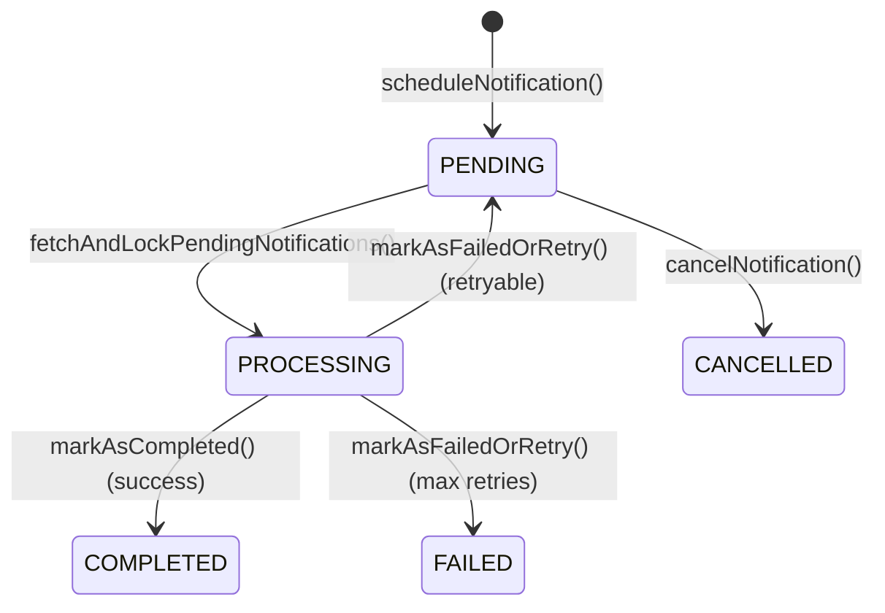
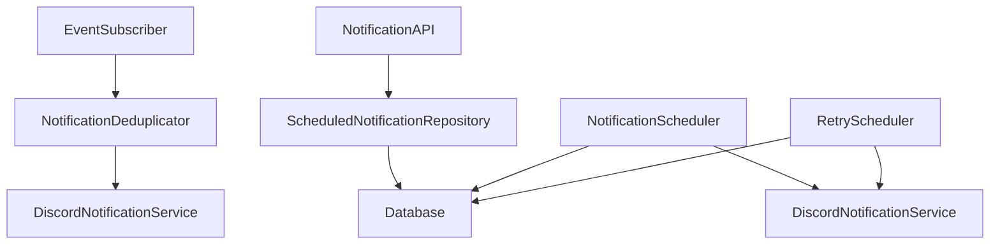

# Notification Lifecycle Documentation

## Overview

The NotifyChain notification system is a robust, multi-component system designed to capture events from Soroban smart contracts, deliver them to configured destinations, and track their entire lifecycle for auditing and debugging purposes.

This document describes:
- The complete state machine for notifications
- The event sequence from creation to delivery/acknowledgment
- The system components involved in each step
- Failure modes and recovery mechanisms

## Quick Reference

| Status | Meaning | Trigger |
|--------|---------|---------|
| `PENDING` | Notification is scheduled but not yet processed | Notification creation via `NotificationAPI.scheduleNotification()` |
| `PROCESSING` | Notification is currently being delivered to its destination | `NotificationScheduler.fetchAndLockPendingNotifications()` |
| `COMPLETED` | Notification was successfully delivered to the destination | Successful execution in `NotificationScheduler.processNotification()` |
| `FAILED` | Delivery failed after maximum retries | `markAsFailedOrRetry()` when `retryCount >= maxRetries` |
| `CANCELLED` | Notification was cancelled before delivery | `NotificationAPI.cancelNotification()` |

---

## State Machine



---

## Data Model

### ScheduledNotification

Located at: `listener/src/types/scheduled-notification.ts`

```typescript
interface ScheduledNotification {
  id: number;                     // Auto-incremented unique ID
  payload: string;                // JSON string of notification payload
  notificationType: NotificationType;  // 'discord', 'email', 'webhook', 'sms'
  targetRecipient: string;        // Webhook URL, email address, etc.
  executeAt: Date;                // When to attempt delivery
  createdAt: Date;
  updatedAt: Date;
  status: NotificationStatus;     // See status enum
  retryCount: number;
  maxRetries: number;
  processingStartedAt?: Date;
  processingCompletedAt?: Date;
  processorId?: string;
  lockExpiresAt?: Date;
  lastError?: string;
  errorDetails?: string;
  eventId?: string;               // Original blockchain event ID (if applicable)
  contractAddress?: string;
  priority: number;               // 1-10, lower = higher priority
  metadata?: string;              // Custom JSON metadata
  nextRetryAt?: Date;
}
```

### Notification Execution Log

Located at: `listener/src/types/scheduled-notification.ts`

Every delivery attempt is logged to `notification_execution_log` table for auditing.

```typescript
interface NotificationExecutionLog {
  id?: number;
  scheduledNotificationId: number;
  executionAttempt: number;
  executionTime: Date;
  status: 'SUCCESS' | 'FAILED' | 'RETRY';
  errorMessage?: string | null;
  responseData?: string | null;
  durationMs?: number | null;
}
```

---

## Architecture Components



### Key Components:

1. **NotificationAPI**: Public entry point for scheduling notifications
2. **ScheduledNotificationRepository**: Database operations for notifications
3. **NotificationScheduler**: Background worker that processes pending notifications
4. **DiscordNotificationService**: Handles Discord webhook delivery
5. **NotificationDeduplicator**: Prevents duplicate delivery of the same event
6. **EventSubscriber**: Polls Soroban for new events and triggers notifications
7. **RetryScheduler**: Processes failed notifications for re-attempt

---

## Complete Lifecycle Flow

### 1. Notification Creation

There are two main ways a notification can be created:

#### A. Scheduled via REST API or TypeScript

1. User calls `NotificationAPI.scheduleNotification()`
2. Input is validated:
   - `executeAt` must be a valid future date
   - `payload` must be an object
   - `targetRecipient` must be provided
3. If idempotency key is provided, `IdempotencyKeyService` checks for duplicates
4. `ScheduledNotificationRepository.create()` inserts the notification into the database with status: `PENDING`
5. `createdAt` timestamp is set automatically

Example creation code:

```typescript
// Using TypeScript API
const notificationId = await api.scheduleNotification({
  payload: { message: "Hello!" },
  notificationType: NotificationType.DISCORD,
  targetRecipient: "https://discord.com/api/webhooks/...",
  executeAt: new Date(Date.now() + 3600000), // 1 hour from now
  maxRetries: 3,
  priority: 5
});
```

#### B. Triggered by Blockchain Event

1. `EventSubscriber` polls Soroban RPC for new events
2. Events are deduplicated using `NotificationDeduplicator`
3. If notification is enabled in user preferences, it's scheduled
4. Same flow as above for storage

### 2. Notification Processing

The `NotificationScheduler` runs in a loop (default: every 10 seconds):

1. **Stale Lock Recovery**: First, it recovers any locks from crashed workers
   - Checks `PROCESSING` notifications where `lockExpiresAt < now`
   - Increments retry count
   - If max retries reached, marks as `FAILED`, else marks as `PENDING`
   - Logs the recovery attempt

2. **Fetch & Lock Pending Notifications**:
   - Uses atomic database query to lock notifications with status `PENDING` and `executeAt <= now`
   - Updates status to `PROCESSING`
   - Sets `processorId`, `lockExpiresAt` (default: 60s), and `processingStartedAt`
   - Orders by priority (ascending) and executeAt (ascending)

3. **Process Each Notification**:
   - Validates notification batch using `BatchValidationService`
   - Checks if shutdown is in progress
   - For each notification in the batch:
     a. Verifies it's within timing buffer (default: ±60s)
     b. Calls the appropriate delivery service based on `notificationType`
     c. If success:
        - Marks notification as `COMPLETED`
        - Sets `processingCompletedAt`
        - Logs execution with status: `SUCCESS`
     d. If failure:
        - Calculates next retry time (exponential backoff)
        - Marks as `PENDING` or `FAILED` if max retries reached
        - Logs execution with status: `RETRY` or `FAILED`

### 3. Notification Delivery (Discord Example)

`DiscordNotificationService.sendEventNotification()`:

1. Checks for duplicates using `NotificationDeduplicator`
2. Formats event message as Discord embed
3. Sends POST request to Discord webhook URL
4. Returns `true` if webhook responds with `ok: true`, `false` otherwise

```typescript
// Example: Discord notification delivery
await discordService.sendEventNotification(
  event,
  { address: "C...", events: ["autoshare_created"] }
);
```

### 4. Retry Logic

When a notification fails:
- `markAsFailedOrRetry()` calculates the next retry time (exponential backoff)
- Sets `nextRetryAt` timestamp
- Increments `retryCount`
- Keeps status `PENDING` if retryCount < maxRetries

The `RetryScheduler` (or main scheduler) will pick it up when `nextRetryAt <= now`

### 5. Terminal States

Notifications reach terminal states when:
- `COMPLETED`: Successfully delivered
- `FAILED`: Exceeded max retries
- `CANCELLED`: Manually cancelled before delivery

These notifications are retained in the database and cleaned up after a retention period (if configured).

---

## Failure Modes & Troubleshooting

### Notification is Stuck in `PENDING`

**Possible Causes**:
- Scheduler is disabled (`SCHEDULER_ENABLED=false`)
- Scheduler is not running
- Notification's `executeAt` is in the future
- Database is inaccessible

**Diagnosis Steps**:
1. Check scheduler logs: `grep 'Starting notification scheduler' logs/app.log`
2. Check notification status via API: `GET /api/schedule/:id`
3. Check statistics: `GET /api/schedule/stats`
4. Verify database file exists: `ls -la ./data/notifications.db`

### Notification is Stuck in `PROCESSING`

**Possible Causes**:
- Worker crashed while processing
- Lock hasn't expired yet

**Diagnosis Steps**:
1. Check if lock is expired: `lockExpiresAt < now`
2. The scheduler automatically recovers stale locks on next poll
3. Manual check: `SELECT * FROM scheduled_notifications WHERE status = 'PROCESSING'`

### Notification Keeps Failing

**Checklist**:
1. Verify target recipient is valid (e.g., Discord webhook URL works)
2. Check `lastError` and `errorDetails` fields
3. Check `notification_execution_log` for detailed attempt history
4. Verify the payload is valid for the notification type

### Duplicate Notifications

**Possible Causes**:
- Events being redelivered due to blockchain reorganization
- Deduplication window expired

**Prevention**:
- `NotificationDeduplicator` uses event ID + contract address to prevent duplicates
- Configure appropriate deduplication window
- Check `processed_events` table to verify

---

## REST API Endpoints

### Schedule Notification
```
POST /api/schedule
{
  "payload": {"message": "Hello!"},
  "notificationType": "discord",
  "targetRecipient": "https://discord.com/api/webhooks/...",
  "executeAt": "2024-12-31T12:00:00Z",
  "maxRetries": 3,
  "priority": 5,
  "metadata": {}
}
```

### Get Notification by ID
```
GET /api/schedule/:id
```

### Cancel Notification
```
POST /api/schedule/:id/cancel
```

### Get Scheduler Statistics
```
GET /api/schedule/stats
{
  "pending": 5,
  "processing": 2,
  "completed": 100,
  "failed": 3,
  "overdue": 1
}
```

---

## Database Schema

### Scheduled Notifications Table
```sql
CREATE TABLE scheduled_notifications (
  id INTEGER PRIMARY KEY AUTOINCREMENT,
  payload TEXT NOT NULL,
  notification_type VARCHAR(50) NOT NULL,
  target_recipient TEXT NOT NULL,
  execute_at DATETIME NOT NULL,
  created_at DATETIME NOT NULL DEFAULT CURRENT_TIMESTAMP,
  updated_at DATETIME NOT NULL DEFAULT CURRENT_TIMESTAMP,
  status VARCHAR(20) NOT NULL DEFAULT 'PENDING',
  retry_count INTEGER NOT NULL DEFAULT 0,
  max_retries INTEGER NOT NULL DEFAULT 3,
  processing_started_at DATETIME,
  processing_completed_at DATETIME,
  processor_id VARCHAR(100),
  lock_expires_at DATETIME,
  last_error TEXT,
  error_details TEXT,
  event_id TEXT,
  contract_address TEXT,
  priority INTEGER NOT NULL DEFAULT 5,
  metadata TEXT,
  next_retry_at DATETIME
);
```

### Indexes
- `idx_scheduled_notifications_status`: Fast status queries
- `idx_scheduled_notifications_status_execute_at`: For scheduler to find due notifications
- `idx_scheduled_notifications_lock_expires`: For stale lock recovery
- `idx_scheduled_notifications_next_retry_at`: For retry scheduling

---

## Configuration

Key environment variables (`.env.example` in listener):

| Variable | Default | Description |
|----------|---------|-------------|
| `SCHEDULER_ENABLED` | true | Enable/disable scheduler |
| `DATABASE_PATH` | ./data/notifications.db | Database file path |
| `SCHEDULER_POLL_INTERVAL_MS` | 10000 | Poll frequency (ms) |
| `SCHEDULER_LOCK_TIMEOUT_MS` | 60000 | Lock expiration (ms) |
| `SCHEDULER_BATCH_SIZE` | 10 | Notifications per batch |
| `SCHEDULER_TIMING_BUFFER_MS` | 60000 | Timing tolerance (ms) |
| `SCHEDULER_PROCESSOR_ID` | auto-generated | Unique worker ID |

---

## Related Documentation

- [README-SCHEDULED-NOTIFICATIONS.md](../../listener/README-SCHEDULED-NOTIFICATIONS.md)
- [SCHEDULED-NOTIFICATIONS-DELIVERY.md](../../SCHEDULED-NOTIFICATIONS-DELIVERY.md)
- [API.md](../../listener/API.md)
